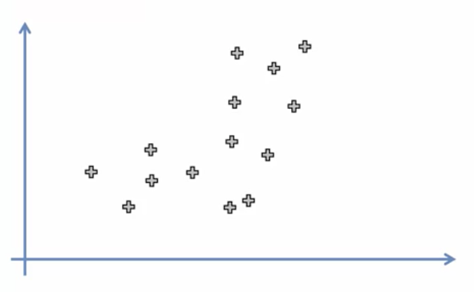
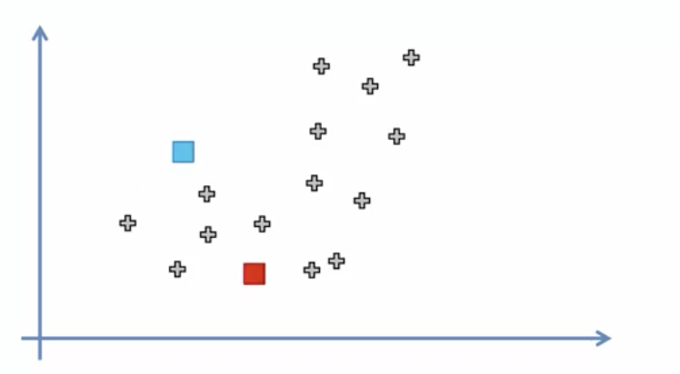
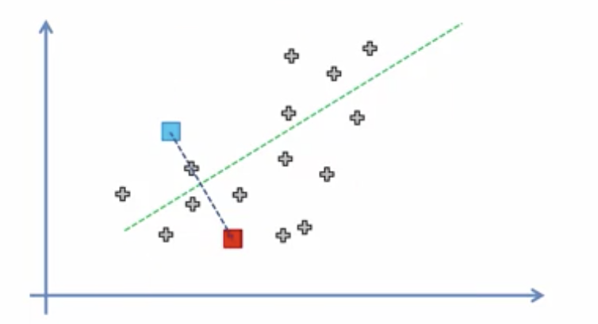
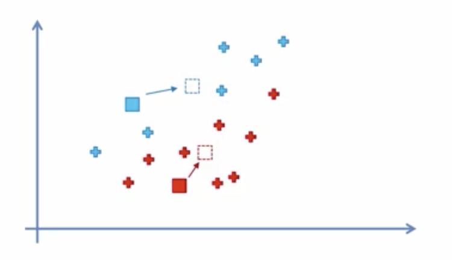

K-means is a clustering algorithm used to categorize data that is unlabeled. It is a type of unsupervised learning (data without categories or groups). The goal is simply to find the groups in the data defined by K. The algorithm works by iteratively assigning each data point to one of the K groups based on the features provided.

Some of the use cases for K-Means are:

- Pattern recognition
- Classification analysis
- Artificial Intelligence
- Image processing
- Machine vision

### Step 1: Choose the number of K of clusters.

We will select 2 for this example so K = 2.

### Step 2: Select at random K points.

In this case we select the points highlighted in blue and red.

### Step 3: Assign each data point to the closest centroid

One way we can go about doing this is by drawing a line from the blue and red points. We then draw a perpendicular line between the two points.

### Step 4: Compute and place the new centroid of each cluster.

In this step we need to find where the new centroid for each cluster is located. We can do so by imagining the current centroids are weightless but no the other points. We can then find the center of gravity (where most of the points are located) to pin point the new centroid.

### Step 5: Reassign each data point to the new closest centroid. Repeat Step 4 if anything was reassigned, else just go to FIN.

In this step we reassign any data points to the new closest centroid we defined on the last step. One way we can do this is by drawing a line between the new centroids and then moving the points.

