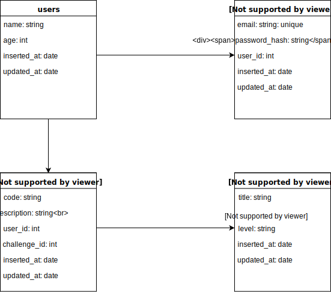

Welcome to part two of Getting Started with Ecto. In the [last post](/getting-started-with-ecto-part-1/), we covered how to install and configure Ecto in our application. In this post we will cover migrations, schemas, and changesets in Ecto.

## Migrations

Now that we have a database and Repo, we are going to create tables and columns. To do that, we will create migrations that define the structure of our tables and define any relationships. Before we create our first migration, let's look at the database design of our demo application.



- Users have credentials with a unique email
- Challenges have many solutions
- Users can have one solution per challenge

#### Generating Migrations

Let's go ahead and create our first migration by running the following generator command:

```bash
mix ecto.gen.migration create_users_table
```

That will create a file inside of `priv/repo/migrations/` that looks something like this:

```elixir
defmodule GettingStartedWithEcto.Repo.Migrations.CreateUsersTable do
  use Ecto.Migration

  def change do

  end
end
```

Lets define our table inside the [`change`](https://hexdocs.pm/ecto/Ecto.Migration.html#module-change) function; this allows us to create reversible migrations.

```elixir
def change do
  create table(:users) do
    add(:name, :string, size: 100)
    add(:age, :integer)

    timestamps()
  end
end
```

The column name and type are defined as atoms. We defined the name as a string with a character limit of 100 and age is an integer. We also use the `timestamps` function that adds `:inserted_at` and `:updated_at` timestamps columns. See the docs for other [primitive types](https://hexdocs.pm/ecto/Ecto.Schema.html#module-primitive-types).

#### Running Migrations

Now that we have our migrations, let's run them with the following command:

```bash
mix ecto.migrate
```

You should see the following output if it succeded:

```bash
16:07:36.057 [info]  == Running GettingStartedWithEcto.Repo.Migrations.CreateUsersTable.change/0 forward
16:07:36.057 [info]  create table users
16:07:36.068 [info]  == Migrated in 0.0s
```

If we look at our database, we see two tables: `schema_migrations` and `users`. The `schema_migrations` keeps track of our migrations and the order they were executed. This allows Ecto to rollback migrations by using the `mix ecto.rollback` command.

Let's move on to the `credentials` migration. I won't go over how to generate and run migrations since that's been covered. This is how our credentials migration should look like:

```elixir
defmodule GettingStartedWithEcto.Repo.Migrations.CreateCredentialsTable do
  use Ecto.Migration

  def change do
    create table(:credentials) do
      add(:email, :string)
      add(:password_hash, :string)
      add(:user_id, references(:users, on_delete: :delete_all), null: false)

      timestamps()
    end

    create(unique_index(:credentials, [:email]))
    create(index(:credentials, [:user_id]))
  end
end
```

Notice that our `user_id` references the `users` table. We set the `:on_delete` to `:delete_all` which deletes the `credentials` record when the user record is deleted. Check out the [Ecto docs](https://hexdocs.pm/ecto/Ecto.Migration.html#references/2-options) for other supported options. Lastly, we set `null` to `false` which prevents the `user_id` from being `null`.

We also created an index on the `email` and a unique index on the `user_id` columns.
See the [`unique_index`](https://hexdocs.pm/ecto/Ecto.Migration.html#unique_index/3) and [`index`](https://hexdocs.pm/ecto/Ecto.Migration.html#index/3) functions for more info.

Our `solutions` and `challenges` migrations don't cover anything new so I will skip them but check out the [source code](https://github.com/edgar971/getting_started_with_ecto/tree/master/priv/repo/migrations) reference.

Let's move on to schemas.

## Schemas

Schemas are modules that represent data from our database. They define the table and column mapping, help functions, and changesets.
It's our database, but in code.

#### Creating Schemas

Let's create our first schema by creating a directory inside the `lib` directory. We currently don't have a generator command so we have to create the directories and files manually 😥. In our demo app, it will be in `lib/getting_started_with_ecto/accounts/user.ex` and it looks like this:

```elixir
defmodule GettingStartedWithEcto.Accounts.User do
  use Ecto.Schema

  schema "users" do
    field(:name, :string)
    field(:age, :integer)

    timestamps()
  end
end
```

We use the [`schema`](https://hexdocs.pm/ecto/Ecto.Schema.html#content) macro to map the user's table and columns to a struct.
We define the name column to a string and the age as an integer. Lastly, we call the [`timestamps`](Generates :inserted_at and :updated_at timestamp fields) function to generate the `:inserted_at` and `:updated_at` timestamp fields.

#### Schema Relationships

Let's create the `credentials` schema. In our demo app, it will be in `lib/getting_started_with_ecto/accounts/user.ex`:

```elixir
defmodule GettingStartedWithEcto.Accounts.Credential do
  use Ecto.Schema
  alias GettingStartedWithEcto.Accounts.User

  schema "credentials" do
    field(:email, :string)
    field(:password_hash, :string)
    belongs_to(:user, User)

    timestamps()
  end
end
```

The new thing here is how we define our one-to-one relationship with the `user` schema. We use the [`belongs_to`](https://hexdocs.pm/ecto/Ecto.Schema.html#belongs_to/3) which does most of the work for us. Notice the first parameter is the name of the relationship and the second parameter is the `User` schema.

We also want to get the credentials when querying the user, let's add that to our `User` schema. We will do that by adding `has_one(:credential, Credential)` to the `User` schema file.

```elixir
defmodule GettingStartedWithEcto.Accounts.User do
  use Ecto.Schema
  alias GettingStartedWithEcto.Accounts.Credential

  schema "users" do
    field(:name, :string)
    field(:age, :integer)
    has_one(:credential, Credential)

    timestamps()
  end
end
```

NOTE: Don't forget to add the `GettingStartedWithEcto.Accounts.Credential` alias at the top of the file.

If your schema has one-to-many association you can use the [`has_many`](https://hexdocs.pm/ecto/Ecto.Schema.html#has_many/3).

Our `solution` and `challenge` schemas don't cover anything new so I will skip them but check out the [source code](https://github.com/edgar971/getting_started_with_ecto/tree/master/lib/getting_started_with_ecto/challenges) reference.

Let's move on to changesets.

## Schema Changesets

The changeset is a function in the schema that allows us to filter and cast our schema fields, as well as track and validate data before it gets to the database.

#### Defining Changesets

Let's define the `changeset` function for our `user` schema file:

```elixir {numberLines: true}
defmodule GettingStartedWithEcto.Accounts.User do
  use Ecto.Schema
  import Ecto.Changeset
  alias GettingStartedWithEcto.Accounts.Credential

  schema "users" do
    field(:name, :string)
    field(:age, :integer)
    has_one(:credential, Credential)

    timestamps()
  end

  def changeset(user, attrs) do
    user
    |> cast(attrs, [:name, :age])
    |> validate_required([:name], message: "Full name is required.", trim: true)
    |> validate_inclusion(:age, 0..120, message: "You need to be human.")
  end
end
```

We first imported the `Ecto.Changeset` and then we defined our `changeset` function with two arguments. The `user` argument can be
a changeset, schema struc, or a tuple with `{data, types}`. The `attrs` argument is a map like `%{"name" => "Alan"}` or `%{name: "Alan"}`.

Let's look at the internals of this function.

In line 17, we piped the `user` to the `cast` function which applies the `attrs` changes to the `user` given a set of allowed keys. In this example, the keys are `[:name, :age]` since those are our schema fields. This means that any other values in the `attrs` map will be ignored and filtered out. Lastly, the `cast` function returns a changeset if everything was successful.

Line 18 is straightforward. We make the `name` field required. [`validate_required`](https://hexdocs.pm/ecto/Ecto.Changeset.html#validate_required/3) has an optional third argument
to add a custom message or trim whitespaces.

Finally, we use the [`validate_inclusion`](https://hexdocs.pm/ecto/Ecto.Changeset.html#validate_inclusion/4) to validate that our age is between 0 and 120. An optional third argument can be provided for a custom message.

Ecto provides other validation function out of the box, check out the [Ecto docs](https://hexdocs.pm/ecto/search.html?q=validate) for more.

Let's move on to creating custom validation functions.

#### Custom Validation Function

We can also define custom functions to validate or change any of the fields in the changeset. Let's create a 
function that checks if the word 'Elixir' is part of the `password_hash` field. 

Define our `credentials` changeset inside it's appropiate schema file. 
```elixir {numberLines: true}
def changeset(credentials, attrs) do
  credentials
  |> cast(attrs, [:email, :password_hash])
  |> cast_assoc(:user)
  |> validate_required([:email, :password_hash])
  |> validate_password()
  |> validate_format(:email, ~r/@/)
  |> unique_constraint(:email)
end

defp validate_password(changeset) do
  isValid =
    changeset
    |> get_change(:password_hash)
    |> String.contains?("Elixir")

  case isValid do
    true -> changeset
    false -> password_invalid(changeset)
  end
end

defp password_invalid(changeset) do
  add_error(changeset, :password_hash, "Invalid password, missing secret word.")
end
```

This changeset is a little more complex since we have more validation. 

In line 4, the `:user` association gets casts with its own changeset. This allows us to create or update the user associated with the credentials. 

In line 6, we call our custom `validate_password` validator function. This function does a simple check on the string
to determine if the word "Elixir" appears within the `validate_password`. It returns the changeset for a valid password, or calls the `password_invalid` function which returns the changeset with an error.

Custom validator functions are flexible and allow you to validate changesets with more granularity. 

Our `solution` and `challenge` changeset don't cover anything new so I will skip them, but check out the [source code](https://github.com/edgar971/getting_started_with_ecto/tree/master/lib/getting_started_with_ecto/challenges) reference.


## Congratulations 🎉 🎉 🎉

We covered a lot of Ecto concepts in this post. We learned how to create migrations, schemas, and changesets. 
If you need more information or have a question, feel free to leave a comment or check out the [Ecto documentation](https://hexdocs.pm/ecto/Ecto.html). On the next post, we will start using our Repo to make database queries.